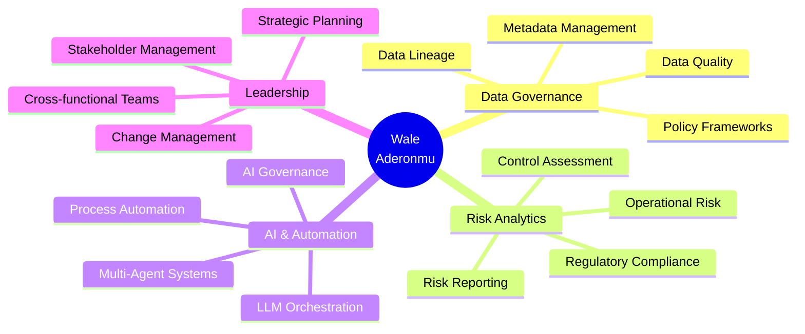

<!-- Header Banner -->

  
# 👋 Hi, I'm Wale Aderonmu

### Data Governance & Risk Analytics Leader | AI Systems Builder

---

## 🎯 About Me

<table>
<tr>
<td width="50%">

### 👤 Profile

🏷️ **Role:** Data Governance & Risk Analytics Professional  
📅 **Experience:** 10+ years in Financial Services  
📍 **Location:** Canada 🇨🇦  
🔨 **Currently Building:** Autonomous Multi-Agent AI Systems  
💡 **Passion:** Where Governance Meets Intelligent Automation

</td>
<td width="50%">

### 🌍 Work Authorization

| Country | Status |
|:-------:|:------:|
| 🇬🇧 UK | **Citizen** |
| 🇺🇸 USA | **TN Visa Eligible** |
| 🇨🇦 Canada | **Resident** |

</td>
</tr>
</table>

### 🎯 Core Expertise

---

## 🚀 Featured Project: Autonomous Compliance Analyzer

### 🤖 AgenticAI Policy Documents Application

**An autonomous multi-agent system that reads, analyzes, and reports on policy documents for compliance assessment.**

### 🏗️ System Architecture

```mermaid
%%{init: {'theme': 'base', 'themeVariables': { 'primaryColor': '#1a1a2e', 'primaryTextColor': '#fff', 'primaryBorderColor': '#0f3460', 'lineColor': '#e94560', 'secondaryColor': '#16213e', 'tertiaryColor': '#0f3460'}}}%%

flowchart TB
    subgraph EXTERNAL["🌐 EXTERNAL DATA SOURCES"]
        direction LR
        PDF["📄 PDF<br/>Documents"]
        DOCX["📝 Word<br/>Documents"]
        TXT["📃 Text<br/>Files"]
        API["🔗 External<br/>APIs"]
    end

    subgraph CORE["⚡ INTELLIGENT PROCESSING CORE"]
        direction TB
        
        subgraph ORCHESTRATOR["🎯 CrewAI ORCHESTRATION ENGINE"]
            direction LR
            TaskQueue["Task<br/>Queue"]
            Memory["Shared<br/>Memory"]
            Delegation["Agent<br/>Delegation"]
        end
        
        subgraph AGENTS["🤖 AUTONOMOUS AGENT NETWORK"]
            direction TB
            
            subgraph A1["AGENT 01"]
                A1Icon["🔍"]
                A1Name["<b>INGESTION</b><br/><i>Document Specialist</i>"]
                A1Skills["• Text Extraction<br/>• Structure Analysis<br/>• Metadata Capture"]
            end
            
            subgraph A2["AGENT 02"]
                A2Icon["📊"]
                A2Name["<b>ANALYSIS</b><br/><i>Compliance Analyst</i>"]
                A2Skills["• Gap Detection<br/>• Risk Assessment<br/>• Regulatory Mapping"]
            end
            
            subgraph A3["AGENT 03"]
                A3Icon["📋"]
                A3Name["<b>SYNTHESIS</b><br/><i>Report Generator</i>"]
                A3Skills["• Executive Summary<br/>• Detailed Findings<br/>• Recommendations"]
            end
        end
        
        subgraph TOOLS["🔧 TOOL LAYER"]
            direction LR
            T1["Document<br/>Reader"]
            T2["Semantic<br/>Search"]
            T3["Template<br/>Engine"]
        end
    end

    subgraph LLM["🧠 LLM BACKBONE"]
        direction LR
        GPT["OpenAI<br/>GPT-4"]
        Claude["Anthropic<br/>Claude"]
    end

    subgraph OUTPUT["📤 MULTI-CHANNEL OUTPUT"]
        direction LR
        Report["📊 Compliance<br/>Report"]
        PDFOut["📕 PDF<br/>Export"]
        Notify["📱 Instant<br/>Notifications"]
    end

    EXTERNAL --> ORCHESTRATOR
    ORCHESTRATOR --> A1
    A1 -->|"Extracted Content"| A2
    A2 -->|"Analysis Results"| A3
    TOOLS <--> AGENTS
    LLM <-->|"Inference"| AGENTS
    A3 --> OUTPUT

    style EXTERNAL fill:#1a1a2e,stroke:#e94560,stroke-width:2px
    style CORE fill:#16213e,stroke:#0f3460,stroke-width:3px
    style ORCHESTRATOR fill:#0f3460,stroke:#e94560,stroke-width:2px
    style AGENTS fill:#1a1a2e,stroke:#e94560,stroke-width:2px
    style A1 fill:#1e3a5f,stroke:#4fc3f7,stroke-width:2px
    style A2 fill:#3d2c5e,stroke:#ce93d8,stroke-width:2px
    style A3 fill:#1b4332,stroke:#81c784,stroke-width:2px
    style TOOLS fill:#37474f,stroke:#90a4ae,stroke-width:2px
    style LLM fill:#4a148c,stroke:#e1bee7,stroke-width:2px
    style OUTPUT fill:#1a1a2e,stroke:#e94560,stroke-width:2px
```

| Layer | Components | Technology |
|:-----:|:----------:|:----------:|
| **🌐 Input** | PDF, DOCX, TXT, Markdown | pypdf, python-docx |
| **🎯 Orchestration** | Task Queue, Memory, Delegation | CrewAI Framework |
| **🤖 Agents** | Ingestion, Analysis, Synthesis | Autonomous AI Agents |
| **🧠 Intelligence** | Reasoning, Generation | GPT-4 / Claude |
| **📤 Output** | Reports, PDF, Notifications | fpdf2, Telegram API |

### ✨ Key Features

| Feature | Description |
|---------|-------------|
| 🤖 **Multi-Agent Architecture** | 3 specialized AI agents working autonomously |
| 📄 **Document Processing** | Supports PDF, DOCX, TXT, Markdown |
| 🔍 **Gap Analysis** | Maps policies to regulatory frameworks |
| 📊 **Risk Assessment** | Prioritizes compliance gaps by impact |
| 📋 **Auto-Reporting** | Generates executive & detailed reports |
| 📤 **Multi-Channel Delivery** | PDF, Telegram, Email export |

---

## 💼 Professional Expertise

### Core Competencies

---

## 🛠️ Technical Skills

### Languages & Frameworks

### AI & ML

### Data & Analytics

### Governance & Compliance

---

## 📈 GitHub Stats

  

---

## 🌍 Work Authorization

| Country | Status | Availability |
|:-------:|:------:|:------------:|
| 🇬🇧 **United Kingdom** | Citizen | ✅ Immediate |
| 🇺🇸 **United States** | TN Visa Eligible | ✅ No Sponsorship Needed |
| 🇨🇦 **Canada** | Resident | ✅ Immediate |

---

## 📫 Let's Connect

**Open to UK contract roles (remote or onsite) and US opportunities (TN eligible)**

---

*"Where Data Governance meets Intelligent Automation"*

