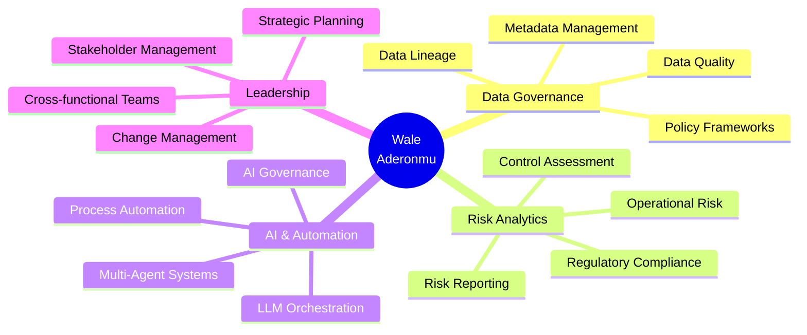

<!-- Header Banner -->
<div align="center">
  
# 👋 Hi, I'm Wale Aderonmu

### Data Governance & Risk Analytics Leader | AI Systems Builder

[](https://linkedin.com/in/YOUR_LINKEDIN)
[](https://github.com/Dewale-A)
[](mailto:aderonmu.ad@gmail.com)


</div>

---

## 🎯 About Me

<table>
<tr>
<td width="50%">

### 👤 Profile

🏷️ **Role:** Data Governance & Risk Analytics Professional  
📅 **Experience:** 10+ years in Financial Services  
📍 **Location:** Canada 🇨🇦  
🔨 **Currently Building:** Autonomous Multi-Agent AI Systems  
💡 **Passion:** Where Governance Meets Intelligent Automation

</td>
<td width="50%">

### 🌍 Work Authorization

| Country | Status |
|:-------:|:------:|
| 🇬🇧 UK | **Citizen** |
| 🇺🇸 USA | **TN Visa Eligible** |
| 🇨🇦 Canada | **Resident** |

</td>
</tr>
</table>

### 🎯 Core Expertise

<div align="center">


</div>

---

## 🚀 Featured Projects: Autonomous AI Systems for Finance

<div align="center">

### 🏦 AgenticLoanOrigination — *NEW*

**A 6-agent autonomous system for end-to-end loan underwriting and decisioning.**

[](https://github.com/Dewale-A/AgenticLoanOrigination)
[]()
[]()
[]()

</div>

```
┌─────────────────────────────────────────────────────────────────────────────┐
│                    AGENTIC LOAN ORIGINATION SYSTEM                          │
├─────────────────────────────────────────────────────────────────────────────┤
│                                                                             │
│   📄 INTAKE           🔍 VERIFICATION        📊 CREDIT ANALYSIS            │
│   ┌─────────────┐    ┌─────────────┐        ┌─────────────┐                │
│   │  Document   │───▶│ Verification│───────▶│   Credit    │                │
│   │   Intake    │    │   Analyst   │        │   Analyst   │                │
│   └─────────────┘    └─────────────┘        └─────────────┘                │
│                                                    │                        │
│                                                    ▼                        │
│   ┌─────────────┐    ┌─────────────┐        ┌─────────────┐                │
│   │    Offer    │◀───│ Underwriter │◀───────│    Risk     │                │
│   │  Generator  │    │  (Decision) │        │  Assessor   │                │
│   └─────────────┘    └─────────────┘        └─────────────┘                │
│         │                                                                   │
│         ▼                                                                   │
│   ┌─────────────────────────────────────────────────────────┐              │
│   │  LOAN DECISION: ✅ Approved | ⚠️ Conditional | ❌ Denied │              │
│   └─────────────────────────────────────────────────────────┘              │
└─────────────────────────────────────────────────────────────────────────────┘
```

**Agents:** Document Intake → Verification → Credit Analyst → Risk Assessor → Underwriter → Offer Generator

| Feature | Description |
|---------|-------------|
| 🤖 **6 Specialized Agents** | Each with distinct role, tools, and expertise |
| 📊 **Risk Scoring Engine** | Credit check, DTI calculation, comprehensive risk model |
| 💰 **Dynamic Loan Pricing** | Rate adjustments based on credit tier and risk level |
| ✅ **Three Decision Paths** | Approve, Approve with Conditions, Deny |

---

<div align="center">

### 🔍 AgenticAI Policy Documents Application

**An autonomous multi-agent system that reads, analyzes, and reports on policy documents for compliance assessment.**

[](https://github.com/Dewale-A/AgenticAI-Policy-Documents-Application)
[]()
[]()
[]()

</div>

```
┌─────────────────────────────────────────────────────────────────────────────┐
│                    AGENTIC POLICY COMPLIANCE SYSTEM                         │
├─────────────────────────────────────────────────────────────────────────────┤
│                                                                             │
│   📁 INGESTION           🔍 ANALYSIS              📋 REPORTING             │
│   ┌─────────────┐       ┌─────────────┐          ┌─────────────┐           │
│   │  Document   │──────▶│  Compliance │─────────▶│   Report    │           │
│   │  Ingestion  │       │   Analyst   │          │   Writer    │           │
│   └─────────────┘       └─────────────┘          └─────────────┘           │
│         │                     │                        │                    │
│         ▼                     ▼                        ▼                    │
│   • PDF/DOCX/TXT        • Gap Analysis           • Executive Summary       │
│   • Key Extraction      • Risk Scoring           • Detailed Findings       │
│   • Structure Parse     • Reg Mapping            • Action Items            │
└─────────────────────────────────────────────────────────────────────────────┘
```

**Agents:** Ingestion Specialist → Compliance Analyst → Report Writer

| Feature | Description |
|---------|-------------|
| 🤖 **3 Specialized Agents** | Autonomous document processing pipeline |
| 📄 **Multi-Format Support** | PDF, DOCX, TXT, Markdown |
| 🔍 **Gap Analysis** | Maps policies to GDPR, SOX, Basel frameworks |
| 📊 **Risk Assessment** | Prioritizes compliance gaps by impact |

---

## 🏗️ System Architecture Philosophy

<div align="center">

```
┌────────────────────────────────────────────────────────────────────────────┐
│                    MULTI-AGENT DESIGN PATTERN                              │
├────────────────────────────────────────────────────────────────────────────┤
│                                                                            │
│    ┌──────────────────┐                                                    │
│    │  📥 INPUT LAYER  │   Documents, Applications, Data Sources            │
│    └────────┬─────────┘                                                    │
│             │                                                              │
│             ▼                                                              │
│    ┌──────────────────────────────────────────────────────────────┐       │
│    │              🎯 CREWAI ORCHESTRATION ENGINE                   │       │
│    │  ┌────────────┐  ┌────────────┐  ┌────────────┐              │       │
│    │  │Task Manager│  │   Memory   │  │ Delegator  │              │       │
│    │  └────────────┘  └────────────┘  └────────────┘              │       │
│    └──────────────────────────┬───────────────────────────────────┘       │
│                               │                                            │
│             ┌─────────────────┼─────────────────┐                         │
│             ▼                 ▼                 ▼                         │
│    ┌─────────────┐   ┌─────────────┐   ┌─────────────┐                   │
│    │  🤖 Agent   │   │  🤖 Agent   │   │  🤖 Agent   │   ...             │
│    │  + Role     │   │  + Role     │   │  + Role     │                   │
│    │  + Tools    │   │  + Tools    │   │  + Tools    │                   │
│    │  + Backstory│   │  + Backstory│   │  + Backstory│                   │
│    └─────────────┘   └─────────────┘   └─────────────┘                   │
│             │                 │                 │                         │
│             └─────────────────┼─────────────────┘                         │
│                               ▼                                            │
│    ┌──────────────────────────────────────────────────────────────┐       │
│    │                    🧠 LLM BACKBONE                            │       │
│    │              GPT-4o  •  GPT-4o-mini  •  Claude 3              │       │
│    └──────────────────────────────────────────────────────────────┘       │
│                               │                                            │
│                               ▼                                            │
│    ┌──────────────────┐                                                    │
│    │  📤 OUTPUT LAYER │   Decisions, Reports, Offers, Alerts              │
│    └──────────────────┘                                                    │
│                                                                            │
└────────────────────────────────────────────────────────────────────────────┘
```

</div>

---

## 💼 Professional Expertise

<div align="center">

### Core Competencies



</div>

---

## 🛠️ Technical Skills

<div align="center">

### Languages & Frameworks


### AI & ML


### Data & Analytics


### Governance & Compliance


</div>

---

## 📈 GitHub Stats

<div align="center">
  


</div>

---

## 🗺️ Project Roadmap

<div align="center">

| Project | Status | Agents | Domain |
|---------|--------|--------|--------|
| 🏦 AgenticLoanOrigination | ✅ Complete | 6 | Lending/Credit |
| 🔍 AgenticAI Policy Docs | ✅ Complete | 3 | Compliance |
| 🎯 AgenticFraudDetection | 🔜 Next | 4+ | Risk/AML |
| 📊 AgenticRiskReporting | 📋 Planned | 5+ | Risk Analytics |

</div>

---

## 🌍 Work Authorization

<div align="center">

| Country | Status | Availability |
|:-------:|:------:|:------------:|
| 🇬🇧 **United Kingdom** | Citizen | ✅ Immediate |
| 🇺🇸 **United States** | TN Visa Eligible | ✅ No Sponsorship Needed |
| 🇨🇦 **Canada** | Resident | ✅ Immediate |

</div>

---

## 📫 Let's Connect

<div align="center">

**Open to UK contract roles (remote or onsite) and US opportunities (TN eligible)**

[](https://linkedin.com/in/YOUR_LINKEDIN)
[](mailto:aderonmu.ad@gmail.com)
[](https://github.com/Dewale-A)

---


*"Where Data Governance meets Intelligent Automation"*

</div>
