<!-- Header Banner -->
<div align="center">
  
# 👋 Hi, I'm Wale Aderonmu

### Data Governance & Risk Analytics Leader | AI Systems Builder

[](https://linkedin.com/in/YOUR_LINKEDIN)
[](https://github.com/Dewale-A)
[](mailto:aderonmu.ad@gmail.com)


</div>

---

## 🎯 About Me

```python
class WaleAderonmu:
    def __init__(self):
        self.role = "Data Governance & Risk Analytics Professional"
        self.experience = "10+ years in Financial Services"
        self.location = "Canada 🇨🇦"
        self.work_authorization = {
            "UK": "Citizen 🇬🇧",
            "USA": "TN Visa Eligible 🇺🇸",
            "Canada": "Resident 🇨🇦"
        }
        self.currently_building = "Autonomous Multi-Agent AI Systems"
        self.passion = "Where Governance Meets Intelligent Automation"
    
    def get_expertise(self):
        return [
            "Enterprise Data Governance",
            "Operational Risk Analytics", 
            "AI/ML Governance Frameworks",
            "Regulatory Compliance (GDPR, SOX, Basel)",
            "Multi-Agent AI Systems"
        ]
```

---

## 🚀 Featured Project: Autonomous Compliance Analyzer

<div align="center">

### 🤖 AgenticAI Policy Documents Application

**An autonomous multi-agent system that reads, analyzes, and reports on policy documents for compliance assessment.**

[](https://github.com/Dewale-A/AgenticAI-Policy-Documents-Application)
[]()
[]()
[]()

</div>

### 🏗️ System Architecture

```mermaid
flowchart TB
    subgraph Input["📁 Input Layer"]
        PDF[("📄 PDF")]
        DOCX[("📝 DOCX")]
        TXT[("📃 TXT/MD")]
    end
    
    subgraph Orchestration["🎯 CrewAI Orchestration"]
        direction TB
        
        subgraph Agent1["🔍 Agent 1: Ingestion Specialist"]
            A1Task["Read & Extract<br/>Policy Content"]
        end
        
        subgraph Agent2["📊 Agent 2: Compliance Analyst"]
            A2Task["Gap Analysis &<br/>Risk Assessment"]
        end
        
        subgraph Agent3["📋 Agent 3: Report Writer"]
            A3Task["Generate<br/>Compliance Report"]
        end
        
        Agent1 -->|"Structured Data"| Agent2
        Agent2 -->|"Analysis Results"| Agent3
    end
    
    subgraph Tools["🔧 Custom Tools"]
        DocReader["Document Reader"]
        DocSearch["Document Search"]
    end
    
    subgraph Output["📤 Output Layer"]
        MD["📄 Markdown Report"]
        PDFOut["📕 PDF Export"]
        TG["📱 Telegram Delivery"]
        Email["📧 Email Delivery"]
    end
    
    Input --> Agent1
    Tools -.->|"Used by"| Agent1
    Tools -.->|"Used by"| Agent2
    Agent3 --> Output
    
    style Agent1 fill:#e3f2fd,stroke:#1976d2
    style Agent2 fill:#fff3e0,stroke:#f57c00
    style Agent3 fill:#e8f5e9,stroke:#388e3c
```



### ✨ Key Features

| Feature | Description |
|---------|-------------|
| 🤖 **Multi-Agent Architecture** | 3 specialized AI agents working autonomously |
| 📄 **Document Processing** | Supports PDF, DOCX, TXT, Markdown |
| 🔍 **Gap Analysis** | Maps policies to regulatory frameworks |
| 📊 **Risk Assessment** | Prioritizes compliance gaps by impact |
| 📋 **Auto-Reporting** | Generates executive & detailed reports |
| 📤 **Multi-Channel Delivery** | PDF, Telegram, Email export |

---

## 💼 Professional Expertise

<div align="center">

### Core Competencies


</div>

---

## 🛠️ Technical Skills

<div align="center">

### Languages & Frameworks


### AI & ML


### Data & Analytics


### Governance & Compliance


</div>

---

## 📈 GitHub Stats

<div align="center">
  


</div>

---

## 🌍 Work Authorization

<div align="center">

| Country | Status | Availability |
|:-------:|:------:|:------------:|
| 🇬🇧 **United Kingdom** | Citizen | ✅ Immediate |
| 🇺🇸 **United States** | TN Visa Eligible | ✅ No Sponsorship Needed |
| 🇨🇦 **Canada** | Resident | ✅ Immediate |

</div>

---

## 📫 Let's Connect

<div align="center">

**Open to UK contract roles (remote or onsite) and US opportunities (TN eligible)**

[](https://linkedin.com/in/YOUR_LINKEDIN)
[](mailto:aderonmu.ad@gmail.com)
[](https://github.com/Dewale-A)

---


*"Where Data Governance meets Intelligent Automation"*

</div>
